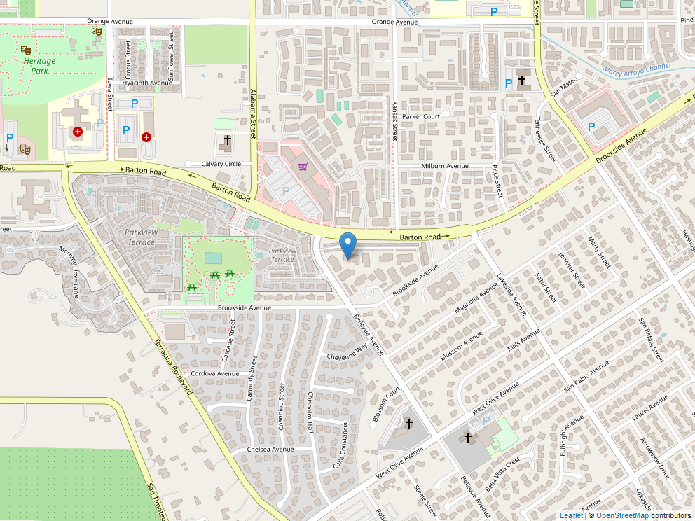

```{r setup, include=FALSE}
library(knitr)
library(sf)
library(tidyverse)
library(leaflet)
knitr::opts_chunk$set(include = FALSE)
source("code/connect_to_survey.R", local = knit_global())
```

```{r Map, include=FALSE}
map<-leaflet() %>%  
  addProviderTiles(providers$OpenStreetMap) %>% 
  addMarkers(data = pod)

mapview::mapshot(map, file = "img/map.png")

# Of course there are many other ways to add mapping, but this was the quick and dirty and if you need more information on how to make a map with R I recommend this link: https://www.r-graph-gallery.com/map.html
```

::: {.center}
{.column-center width="488"}
:::

::: {.column-left}
#### **Observer:** `r pod$lastname[1]`, `r pod$firstname[1]`
:::

::: {.column-right}
#### **Date Observed:** `r pod$date_collected[1]`
:::

::: {.column-left}
#### **Species:** `r pod$scientific_name[1]` (`r pod$common_name[1]`)
:::

::: {.column-right}
#### **Coordinates:** `r pod$latitude[1]`°N `r pod$longitude[1]`°E, WGS84
:::

<p>

 

</p>

#### **Location Description:**

`r pod$other_locality_data[1]` . Found in `r pod$County_[1]` county, Arizona.

#### **Habitat Description:**

`r pod$Habitat_Description[1]`

#### **General Description:**

This is were you could add any information in addition to what else you had in the comments when you conducted and uploaded the observation. However, since this is just to show how one can create an active document tied to the survey123 data I am just having the comments appended to this paragraph. `r pod$Comments[1]`

<p>

 

</p>

<p>

 

</p>

#### **Scientific Collection Information:**

| Current SP\#              | Year                    | First Name           | Last Name           | Affiliation            | Date Submitted:                     | Submitted to: |
|---------------------------|-------------------------|----------------------|---------------------|------------------------|-------------------------------------|---------------|
| `r pod$license_number[1]` | `r pod$current_year[1]` | `r pod$firstname[1]` | `r pod$lastname[1]` | `r pod$affiliation[1]` | `r format(Sys.time(), '%d %B, %Y')` | AZGFD         |
